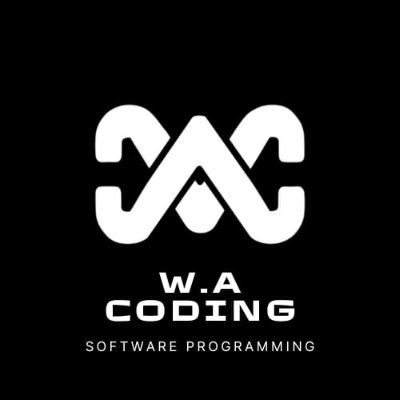
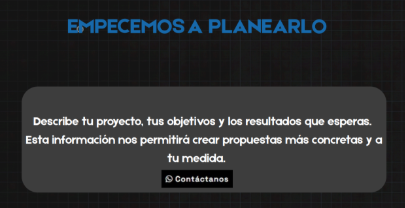
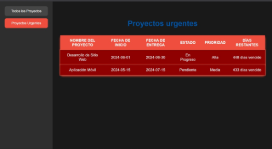
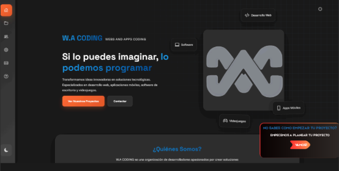

**HAKATON PROYECT**

(EMPECEMOS A PLANEAR TU PROXIMO PROYECTO)

**Integrantes.**

- Carlos Jesus Sotelo Piña
- José Ricardo González Hilario

**Planeación.**

Para este Proyecto se usará como idea una adición a la pagina de WA.CODING.ORG. en la que implementaremos una nueva sección a la página. 

La idea de esta sección es ayudar a aquellos que quieren empezar su proyecto, pero no están relacionados con el tema de el desarrollo de páginas web, aplicaciones móviles, etc. 

Es una forma de orientar al cliente para apoyarlo en su proximo proyecto, ofreciéndole asesoría y guiarlo, así como también trabajar un boceto de lo que solicite. Le solicitaremos una pequeña idea de lo que tiene en mente con su proyecto y le proporcionaremos ideas de como realizarlo, realizaremos el boceto y se mantendrá contacto con la persona para guiarla y convenserlo de que nuestro trabajo es el indicado.

**Objetivos especificos**.

- Lograr una mejor comunicación con el cliente para comprender mas a detalle sus necesidades si aún no sabe con exactitud como idear su proyecto 
- Concer la carga de proyectos del equipo para darles mayor prioridad a algunso con respecto al tiempo que tenemos 

**Realización.**

- Se agregara una ventana emergente a la pagina de WA.CODING con el texto ¨**NO SABES COMO EMPEZAR TU PROYECTO? EMPECEMOS A PLANEAR TU PROYECTO**¨, presionandola te mandara a un pequeño cuestionario que nos ayudara a orientar al cliente con ejemplos apegados a sus peticiones.

![ref1]

- Para el menú se le dará al cliente una introducción a lo que se le ofrecerá en base a los datos que nos proporcione en un cuestionario y un botón para contactarnos a través de WhatsApp con un mensaje predefinido y así empezar el apoyo. 

- Al igual se inclura un apartado para agendar una fecha de entrega de proyectos futuros con el cliente, con el fin de que estemos enterados de todos los proyectos y los que son urgentes y para conocer nuestra carga de trabajo y la fecha de entrega.

![ref2]  

**Aportes.**

17/9/2025

**Carlos** proporciona la idea a Ricardo y este la aprueba, por lo que se procede con la realización de está.

**Carlos** empieza con el código, realizando un boceto de la card. Se integraron 3 archivos hasta el momento.

- Card.html
- Styles\_card.css
- App.js

![ref3]

18/9/2025

**Carlos** empieza a trabajar en el menú de guía para el potencial cliente, agrega las instrucciones y el botón.

Carlos crea los archivos:

- Index.html
- Styles\_index.css

19/9/2025

**Carlos** comienza con el apatado de proyectos pendientes y los proximos a ser urgentes para optimizar el trabajo de ellos.

![ref2]

19/9/2025

**Ricardo** empieza la modificación al diseño de ventana emergente como de la modificación de la pagina de recabación de datos del cliente para su proyecto.

20/9/2025

**Ricardo** crea la documentación final del hakaton y de todo lo que se realiza en la optimización del proyecto llamado  "EMPECEMOS A PLANEAR TU PROXIMO PROYECTO" 

[ref1]: Aspose.Words.11ded478-5644-44f6-a6f9-62219da42f26.002.png
[ref2]: Aspose.Words.11ded478-5644-44f6-a6f9-62219da42f26.004.png
[ref3]: Aspose.Words.11ded478-5644-44f6-a6f9-62219da42f26.006.png
